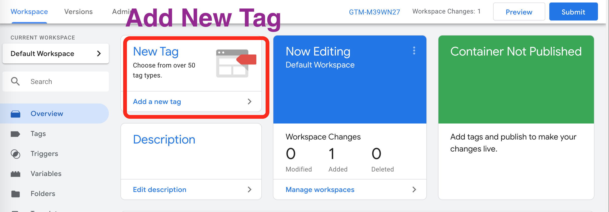
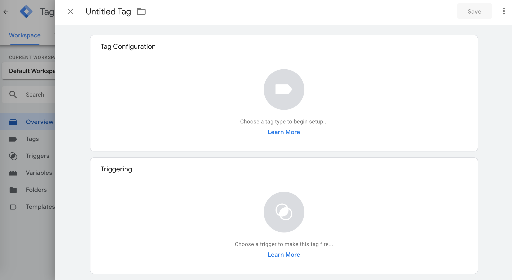
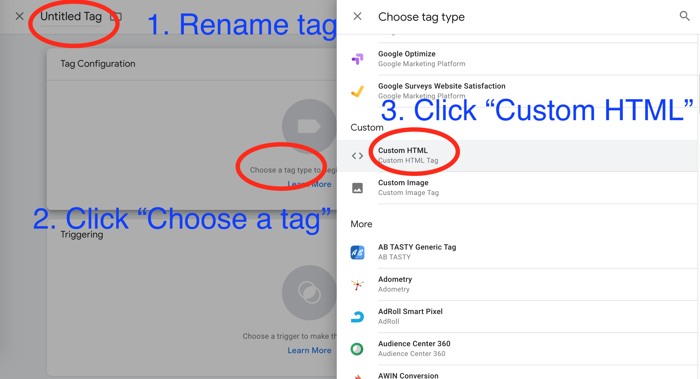
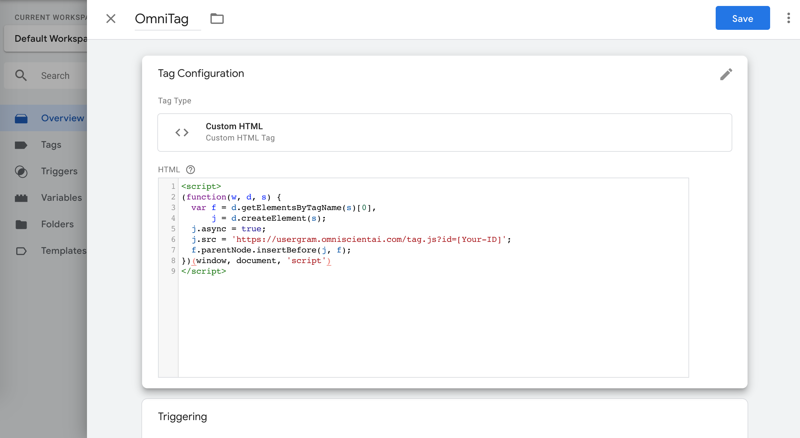
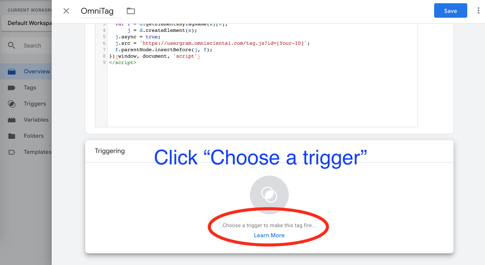
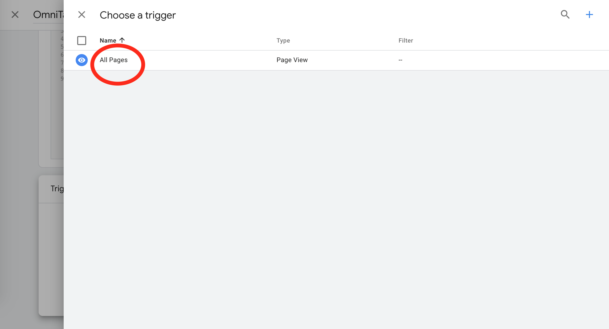
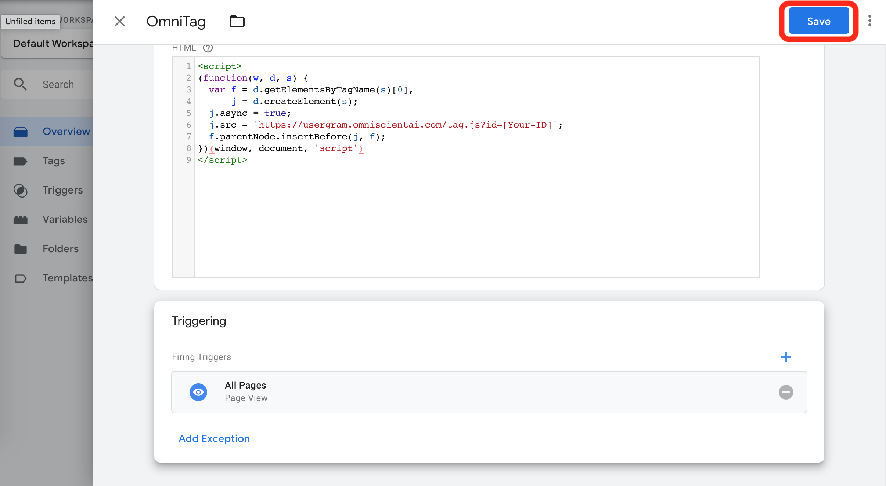

# GTM

## 如何產生新TAG
### 點選圖片 "Add a new tag"


### 產生新Tag畫面


### 產生自訂HTML Tag
1. 修改Tag的名字
2. 點選 choose a tag
3. 從展開選單點選"custom html"


### 填入自訂HTML
#### 1. 填入以下 OmniTag 語法, 並置換 ```[Your-ID]```
```
<script>
(function(w, d, s) {
  var f = d.getElementsByTagName(s)[0],
      j = d.createElement(s);
  j.async = true;
  j.src = 'https://usergram.omniscientai.com/tag.js?id=[Your-ID]';
  f.parentNode.insertBefore(j, f);
})(window, document, 'script')
</script>
```



#### 2. 點選 "Chooose a trigger"


#### 3. 選擇 'All Page'


#### 4. 確認無誤後按儲存(Save)

