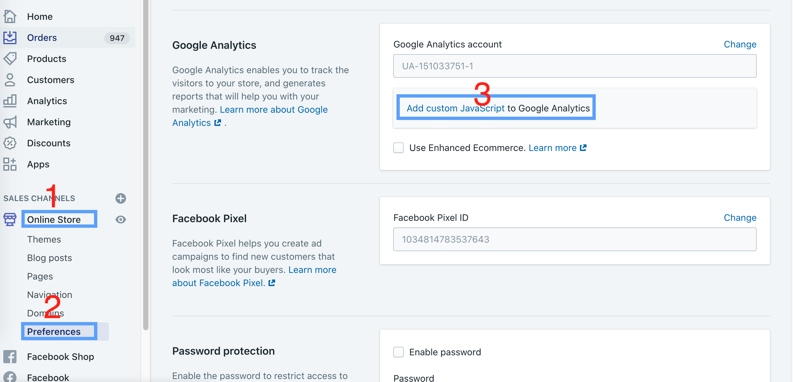

# Shopify add tag-app.js

## Add tag-app.js to shopify ga custom JS

### Go to [Online store > Preferences](https://www.shopify.com/admin/online_store/preferences). 




### Copy and paste following code (tag-app.js)
```
(function() {
  var doc = document;
  var el = doc.createElement('script'); el.type = 'text/javascript';
  el.async = true;
  el.src = (('https:' == doc.location.protocol) ? 'https://' : 'http://') +
           'omnitag.omniscientai.com/tag-app.js';
  var s = doc.getElementsByTagName('script')[0]; s.parentNode.insertBefore(el, s);
})();
```

### Final
When you finish this, you don't need add tag-app.js by yourself.

But please make sure, you prepare window.i13nData before tag-app.js render.

You could use browser view html source to check it.

* [more detail](https://github.com/omnitag/omnitag/wiki/API)

```
// you don't need this
<script async src="https://omnitag.omniscientai.com/tag-app.js"></script>
```


<script>
(function() {
  var links = document.getElementsByTagName('a');
  for (var i = 0; i < links.length; i++) {
    if (/^(https?:)?\/\//.test(links[i].getAttribute('href'))) {
      links[i].target = '_blank';
    }
  }
})();
</script>
